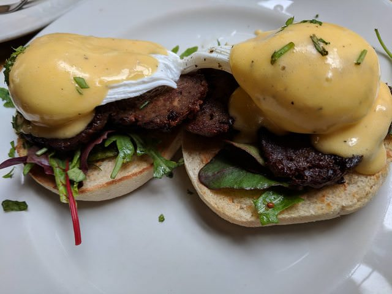

A lot has happened in this past week: I started new projects at work, tried new foods, and went to Bath for the bank-holiday weekend (in fact, I'm writing this post from a park in Bath!) Unfortuately, I can't talk too much about the new projects at work (I am under NDA, after all), however, I did get to work on the new report from Z/Yen Group coming out on 6 June about timestamping. I edited the report and continued working on the new website. I'm also helping out with some of the designs for it! 

Michael also took Ian and me out for lunch to a local bar. We (unexpectedly) downed two pints with him and talked a bit about the company and his travels. We also ate scotched eggs (and I'm a HUGE fan).

---

Ian and I left for Bath after work on Friday (really, it was after grabbing a couple pints [and a tequila shot] with our coworkers) and we arrived at our airbnb around midnight. I'll update the blogpost with some images from the airbnb later, because I don't think works suffice to describe just _how_ weird it is. There are nude, exotic paintings on the walls, it smells of cigarettes, and the carpet probably hasn't been deep cleaned since it was installed. Granted, it was cheap. Our host is very kind and a great conversationalist (and the most English looking gent possible). At least we have a story to return with!

Bath in itself is fantastic. The food (oh my) has been delicious, and the people very welcoming. We found a hole-in-the-wall brunch place called Wild Cafe and had possibly the best Eggs Benedict I will ever have in my life. Ian got a classic, with smoked salmon while I opted for a butcher's faggot. I may have found my new go-to breakfast recipe! 

 

Afterwards, we walked around Bath, grabbed a pint, and sat down by the river eating fresh strawberries. Fruit in America just can't compare! We also ate fudge at a location recommended by our coworker (thank you Alexandra, it was fantasic!) and from there, we were directed to a pub with an 8.4ABV cider called *The Wobbler*. Let me just leave it at Ian and I _definitely_ wobbled home.

At the pub we were lucky to meet a few chaps who attended a local university for acting. We talked to them over the Real Madrid vs Liverpool game and definitely have a few stories to bring back home.

I really couldn't ask for a better second week!