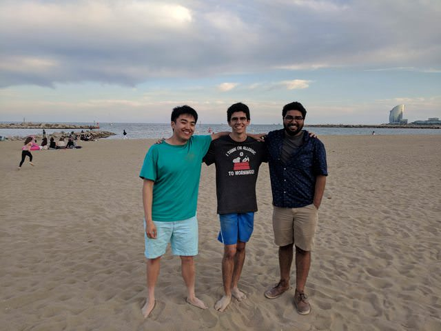

***work***

 Troughout the whole week, I've been working on the new Z/Yen website and learning basic economic theory.

However, I got to work on some of the more technical ventures of Z/Yen Group. [Metrognomo](https://www.metrognomo.com/) is a discrete coordinate representation designed for convenience, and I've been working with the development team to see if there are other ways of representing coordinates, such as with sound! We're trying to design a one-to-one function for translating a string of hex characters into a short musical tone (that also sounds good!). If you know of one, please email me at nish.nha [AT] gmail DOT com.

I was also placed on the PR team for Z/Yen to work alongside the Director of Distributed Futures to promote Long Finance and other Z/Yen Group ventures. The initial PR meeting gave me insight into how quickly Z/Yen is able to pivot--prior to this Z/Yen has never worried about spreading their name or PR as a whole.

On Wednesday I attended a CSFI round-table discussion at the Baker's Hall. There was also a cheese fesival happening nearby!

---
***food***

* I discovered a new, local South American restaurant called Assenheim 56. Not sure what the name means, but their food is damn good!

* Turns out, there's a service in London called [Waso sushi](https://www.waso.tokyo/order) which delivers freshly made Japanese bento to your workplace! I have yet to try it, but I'm excited.

---

***Spain***

I took off Friday of this week to travel to Spain. Unfortunately, because my flight was literally canceled at the gate (shout out to [Vueling for having a horrible social media team](https://twitter.com/Nishnha/status/1002886483655712769)) I missed a full day of travel anyways.

However, on my flight to Spain, I did meet a local who gave amazing restaurant recommendations (thank you, Nicole)! I landed in Spain, dropped my luggage off at my airbnb, and headed out to meet up with some Friends who were also spending the weekend there, Onur and Edward.

I'm a frequent traveller, but I have never had as much fun as I had in Spain. Not only was the weather *gorgeous*, but the food was delicious, the cervezas was cheap, and the music was overflowing with culture.

I wish I didn't leave!

See more photos from my trip to Spain (and follow me) on my [Instagram](https://www.instagram.com/nishnha/).