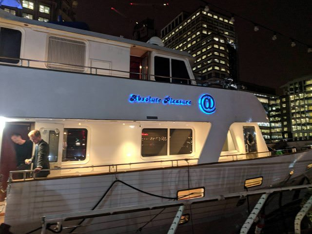
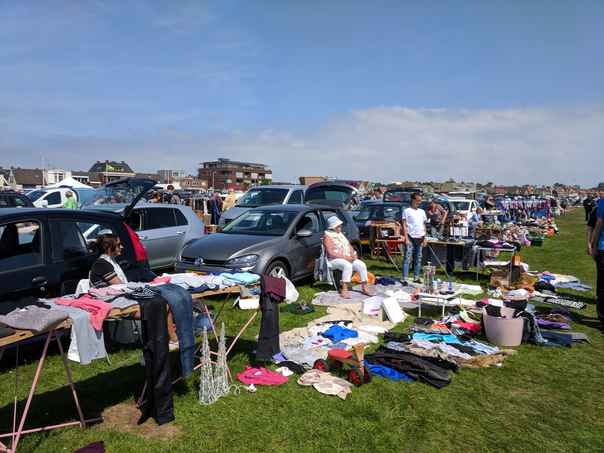
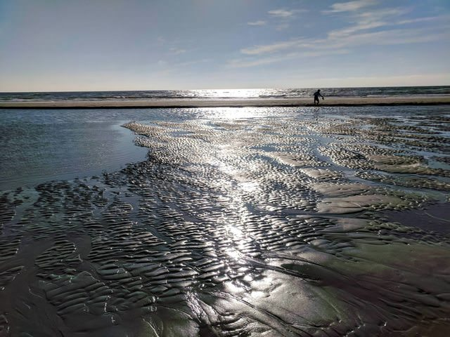

I began this week on a Tuesday since I was out on travel on Monday. You can read about it in [the previous blog post](/posts/spain-london-week-3). Tuesday was a rather normal work day--I worked on the new Z/Yen website and put together packets for the World Trader's annual meeting in Dublin.

This week was a big one for me at work: [Z/Yen released a report on Timestamping](http://www.zyen.com/what-we-do/mutual-distributed-ledgers/65-publications/1776-timestamping-smart-ledgers-comparable-universal-traceable-immune.html)!
The report launch took place on Wednesday morning and we a had a fantastic turnout. This was a huge win for me personally, as well, since I edited the report!

Following the release, Ian and I went to another event in Amorour's Hall. The event was on legislation preparation for Brexit and the venue was gorgeous!

With the world cup coming up, we also decided to have a Z/Yen office lottery. 

On Thursday we continued working on the new Z/Yen website, and following that, Ian and I went to a yacht party held by the Metro Chamber of Atlanta.

Michael didn't seem particularly interested in attending, and was only present for a few minutes. However, Luke, Dalton, Katherine, Ian, and I had much fun!

The event definitely pushed me outside of my comfort zone. I was not used to seeing so many business people and I was especially not used to seeing them on a yacht. However, I feel like this event is important for career-building. Hopefully, this won't be the last time I'll be pushed outside of my comfort zone like this and practice makes perfect!

Above: The Lady Daphney 2.0

---
***Amsterdam***

I wrote a bit about my adventure from the yacht to the airport in [my previous post](/posts/spain-london-week-3), but in recap, I got no sleep from going to work Thursday morning all the way to arriving in Amsterdam.

Upon arrival on Saturday, Ian and I got very lost. We took a train from the airport into the city of Amsterdam and walked in the wrong direction for about an hour. Even worse, we ended up venturing through a gate and realised we couldn't open it and that there was no way around it. Luckily, we got out after about an hour by walking through an office building and headed for breakfast.

. . .

While Ian and I had great fun in Amsterdam, we ended up staying outside of the city on a costal town named Wik Aan Zee. The area was apparently a tourist destination for the Dutch, but hey, at least there aren't souvenir shops on ever street corner like Amsterdam!

Below: A market I ran into in the town I was staying in.

The town was beautiful and our Airbnb was only a 10 minute walk from the beach. Even cooler, the beach was a historical WWII lookout point and there were even bunkers to explore. From the bunkers we could see out over the town (which is how we spotted the market), look to the beach and ocean, and gaze at an old steel mill out in the distance.

Above: the ocean floor revealed after the tides receeded in costal city near Amsterdam.

Ian and I were accompanied by Claudia and Trey as we explored the area. On our second day of the trip we all explored Amsterdam and after a long day we got together and made a fancy dinner.

To see more Amsterdam pictures, check out my [Instagram](https://www.instagram.com/nishnha/)!
